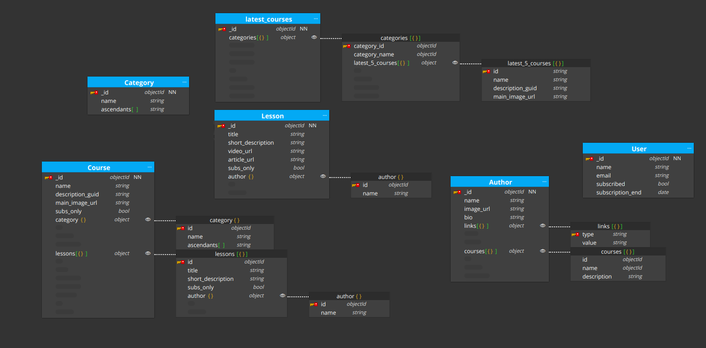

# Módelo básico y tareas opcionales

En el texto se pueden ver los cambios respecto al modelo básico marcados con un ❗

## Colecciones y patrones utilizados

- Course: Esta colección contiene la información necesaria para mostrar la página individual de cada curso.
  - name: Nombre del curso.
  - description_guid: referencia a la ficha de descripción del curso.
  - main_image_url: url hacia la imagen que se muestra tanto en la preview del curso como en el título de la página.
  - ❗subs_only: Este campo sería *true* si todas las lecciones pertenecientes al curso son solo para suscriptores. Esto lo actualizaríamos utilizando el patrón **Computed** cada vez que actualizáramos este valor en una lección o creáramos una nueva lección dentro del curso
  - ❗category: categoría del curso. Embebemos la colección completa para tener también una referencia a los ancestros y facilitar encontrar el nodo raíz para actualizar la colección de la página principal.
  - ❗lessons: Un array que contiene la información necesaria de las distintas lecciones de cada curso en esta página. Así podemos aplicar el patrón **Extended Ref** para obtener la información que necesitamos. Como en la página del curso queremos mostrar los distintos autores, embebemos también el autor y mediante programación extraemos los distintos autores de este campo para tener la lista global. También almacenaremos si la lección se encuentra disponible solo para suscriptores o no, de forma que solo mostremos al usuario los vídeos que pueda vez.

- Lesson: Esta colección contiene la información de cada lección individual dentro de un curso.
  - title: Título de la lección.
  - short_description: Descripción corta que se muestra en la ventana del curso.
  - video_url: La URL al storage en el que se almacena el vídeo de la lección.
  - article_url: La url donde se almacena el texto explicativo de la lección.
  - ❗subs_only: Mediante este boolean marcaremos que el título es de acceso exclusivo para usuarios que estén suscritos.
  - author: Aplicamos el patrón **Extended Ref** para tener tener el nombre del autor y disminuir el tamaño del archivo, ya que la biografía, por ejemplo, no nos interesa. Podemos aplicar este patrón puesto que el nombre del autor no es algo que vaya a actualizarse muy a menudo.

- Author: Esta colección contiene todos los campos pertenecientes al autor que se mostrarán al acceder la página del mismo.
  - name: Nombre del autor.
  - image_url: URL hacia la imagen del autor.
  - bio: La biografía del autor.
  - links: Un array que contiene los distintos enlaces a redes sociales del autor. Como existen diversas redes sociales, los autores no tienen por qué tenerlas todas y, además, pueden aparecer nuevas o desaparecer con el tiempo, utilizamos el patrón **Attribute**, siendo la clave la red social (campo type) y el valor la propia URL del perfil del autor.
  - courses: Un array que contiene los datos necesarios de los distintos cursos en los que ha participado el autor. Aplicamos el patrón **Extended Ref** y embebemos la información que necesitamos. Además, como los autores de un curso no suelen cambiar demasiado y esta página tendrá poco uso, también aplicaremos el patrón **Computed** para calcular cada X horas los cursos en los que ha participado un Autor y actualizar esta información.

- Category: Esta colección nos serviría para guardar las distintas categorías disponibles para los cursos
  - name: El nombre de la categoría.
  - ❗ancestors: Aplicamos el patrón **Tree** de antecesores. El motivo de almacenar solo los antecesores es por utilidad, ya que aunque cueste más encontrar las hojas, en la página principal seguiremos mostrando las categorías raíz (las que no tienen antecesores) y solo necesitaremos cargar las hojas a la hora de crear un curso, para poder saber la estructura, por lo que podemos hacerlo de forma programática y ahorrarnos un espacio en el resto de documentos en los que está presente la categoría.

- Latest_Courses: En esta colección mantendríamos los últimos 5 cursos de cada categoría.
  - categories: En este array tendremos una entrada por cada categoría raíz. Dentro de cada entrada almacenaríamos la categoría en sí (Front End, Back End, Devops, etc) y los últimos 5 cursos de dicha categoría. Para esto utilizaremos el patrón **Computed**, de manera que cada vez que creemos un curso, puesto que se espera que sea una o dos veces al día, se actualicen estos 5 cursos. La información de cada curso la almacenaremos usando el patrón **Extended Ref** para tener la información mínima necesaria.

- ❗User: Esta colección almacena los usuarios y el estado de su suscripción.
  - name: Nombre del usuario.
  - email: Correo electrónico del usuario.
  - subscribed: Indica si el usuario esta suscrito o no.
  - subscription_end: Indica la fecha en la que se acaba la suscripción del usuario.
